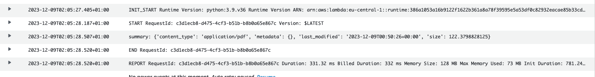

# Powerex interview task

This repo containts all configurations and source code required to fullfil interview task from Powerex

- [Submission](#submission)
- [Solution](#solution)
  - [Required tools](#required-tools)
  - [Infrastructire provisioning](#infrastructire-provisioning)
  - [Lambda function](#lambda-function)

## Submission

Create AWS Lambda with Layers and S3 Trigger

**Background:**
You are tasked with deploying a serverless application on AWS.
The application includes a Python Lambda function that is triggered by the addition of a file to an S3 bucket.
To enhance code reuse and maintainability, you are required to utilize AWS Lambda Layers to manage common dependencies shared across Lambda functions.

**Requirements:**

1. Use Terraform to define the entire serverless infrastructure.
2. Create a Python Lambda function triggered by the addition of a file to an S3 bucket and performing a task such as processing the file somehow using lib from layer.
3. Utilize AWS Lambda Layers to manage common Python dependencies (e.g., libraries or packages) used by your Lambda function. Store Layer in S3.
4. Set up an S3 bucket and configure it to trigger the Lambda function upon the addition of a new file.
5. Use Terraform variables for configuration and flexibility.
6. Implement appropriate IAM roles and permissions for the Lambda function, Lambda Layer, S3 bucket, and other AWS resources.
7. Document your solution in a README.md file. Include details on how to deploy the infrastructure and layer creation.

**Bonus:**

- Explore ways to secure the serverless infrastructure, especially around S3 triggers. Consider using bucket policies and IAM roles.
- Implement logging and monitoring for the Lambda function and S3 events.
- Ensure that the infrastructure is deployed in at least two availability zones (AZs) for high availability.
- Instead of python lambda create java lambda supporting snap start
- Automatize layer creation
- Github actions pipeline creation
- Any other cool feature that you want to try or like

**Submission:**
Share your Terraform code in a GitHub repository. Include the README.md file with deployment instructions, explanations, and any additional context or assumptions made during the implementation.

## Solution

Here you can find step-by-step guide how to solution of the task was performed and how to replicate it with coresponding commands

### Required tools

- Terraform
- Git

## Structure

- `terraform` - includes all terraform related configurations to deploy AWS resources
- `scripts` - includes helper scripts
- `file-metadata` - file metadata function source code

### Infrastructire provisioning

To provision the resources we use Terraform. To simplify the code and increase readability, we create a separated module for Lambda function related stuff and for possible reuse in the future. To run the terraform configurations, you should create/use a `tfvars` file similar to one provided below.

Example variables file:

```terraform
aws_role_arn                  = "arn:aws:iam::12345678:role/demo"
lambda_function_name          = "demo-lambda"
s3_lambda_layer_bucket_name   = "demo-layer-bucket"
s3_lambda_trigger_bucket_name = "demo-bucket"
```

After successful resource create, we can upload a file into the demo bucket to try out and test the Lambda function invocation.

```bash
aws s3 cp <file> s3://powerex-demo
```

If the invocation was succesfull, we can check the logs in the log group `/aws/lambda/<function_name>`. We should see similar output, where the summary field represents the actual "processing" of uploaded file into to S3 bucket.



### Lambda function

For this task we decided to implement `file-metadata` Lambda function. It fetches newly added object in specified bucket, and prints and returns it's content type, metadata and last modified date. To decrease the size of lambda function, we leverage AWS Lambda Layers to store the function's dependencies.

### Scripts & helpers

To build a Lambda Layer with the function dependencies, we created small script [10-build-layer.sh](./scripts/10-build-layer.sh) to simplify this process and to ensure alignment with the structure requirements.

### Pipelines

This project uses two pipeline workflows. [terraform.yml](./.github/workflows/terraform.yml) is used for auto provisioning of Terraform resurces. [destroy.yml](./.github/workflows/destroy.yml) is manually triggered job in case of destroying the infrastructure.

### Technical debt & enhancements

- to ensure consistency between Terraform runs, we are using s3 backend for terraform state with dedicated IAM role. This role has to be changed in [terraform.tf](./terraform/terraform.tf#L17) file and should have minimal permission accoring to [docs](https://developer.hashicorp.com/terraform/language/settings/backends/s3#s3-bucket-permissions). For now the backend in not using locking mechanism.
- for S3 monitoring and auditing I'd use either Cloudwatch (logs and events) or CloudTrail
- for better reliability we could have used Eventbridge which supports DLQ for the target invocation and it doesn't require additional permissions for S3 service to push events to EventBridge
- Lambda Layer could be created in CI/CD pipeline in separate steps, which would simplify terraform resource dependencies
- it wasn't necessary to specify any Lambda Layer since both, Lambda function and Lambda Layer, are residing in the same AWS account
- Lambda function are by default managed by AWS, so we can assume they are high available out of box. Anyways, to achieve custom HA setup, we can deploy the function inside our managed VPC and define multiple subnets in different AZ's, in case of one AZ unavailability. However, the introduction of VPC would enhance the security in following manner:
  - using VPC endpoints we have more control over access to S3 bucket
  - we can restrict who can access the VPC itself and it's endpoints
  - with VPC endpoints, the access is limited to private network provided by AWS, so we can avoid access S3 over public internet
